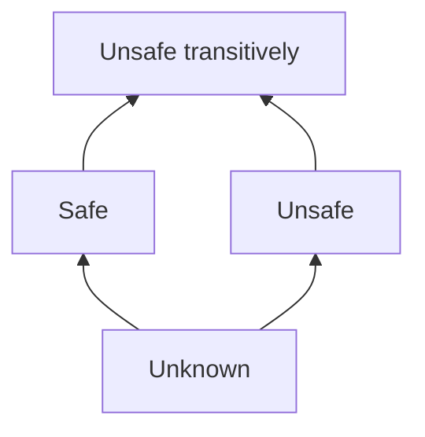

# Unit test IO usage analysis

- For each funtion determine IO usage (uses (unsafe), don't uses (safe), uses transitively, unknown)

| **f\(x\)**              | **⊥ \(unknown\)** | **safe**            | **unsafe**          | **unsafe transitively** |
|-------------------------|-------------------|---------------------|---------------------|-------------------------|
| **⊥ \(unknown\)**       | ⊥                 | ⊥                   | ⊥                   | ⊥                       |
| **safe**                | ⊥                 | safe                | unsafe transitively | unsafe transitively     |
| **unsafe**              | ⊥                 | unsafe transitively | unsafe transitively | unsafe transitively     |
| **unsafe transitively** | ⊥                 | unsafe transitively | unsafe transitively | unsafe transitively     |

